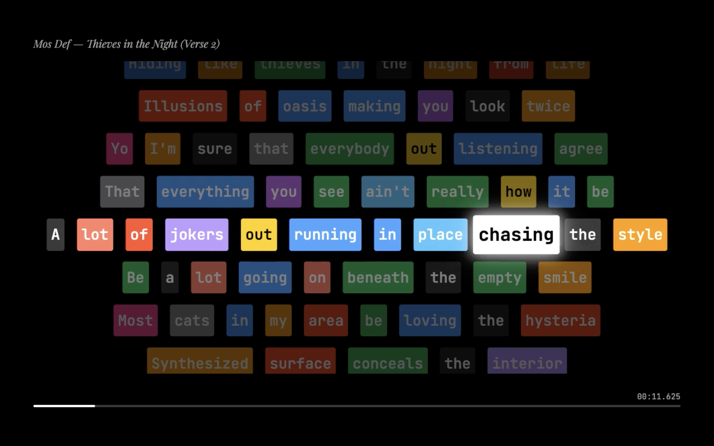

# Rap Rhyme Highlighter 🎤

A web application that analyzes rap lyrics for rhyme schemes and produces synchronized videos with real-time word highlighting. Uses phoneme-based rhyme detection and Whisper AI for audio alignment.



## Features

- **Phoneme-based Rhyme Detection** — Uses the CMU Pronouncing Dictionary to identify rhyme families based on actual pronunciation, not just spelling
- **Audio-Lyric Alignment** — Powered by OpenAI Whisper for accurate word-level timestamps
- **Multiple View Modes**:
  - **Text Mode** — Analyze lyrics without audio, see rhyme patterns highlighted
  - **Auto Mode** — Upload audio + lyrics, get synchronized playback
  - **Finetune Mode** — Manually adjust word timings and rhyme groups
  - **Perform Mode** — Live karaoke-style display
  - **Capture Mode** — Cinematic 1280×720 view optimized for video recording
- **Video Export** — Generate polished MP4 videos with synchronized highlighting

## Demo

https://github.com/MunamWasi/Rhyme-CTRL/blob/master/output_cinematic.mp4

## Quick Start

### Prerequisites

- Python 3.9+
- FFmpeg (for video export)
- ~2GB disk space (for Whisper model)

### Installation

```bash
# Clone the repository
git clone https://github.com/yourusername/rap-rhyme-highlighter.git
cd rap-rhyme-highlighter

# Create virtual environment
python3 -m venv venv
source venv/bin/activate  # On Windows: venv\Scripts\activate

# Install dependencies
pip install -r requirements.txt

# Install Playwright for video capture (optional)
pip install playwright moviepy
python -m playwright install chromium
```

### Running the App

```bash
# Activate virtual environment
source venv/bin/activate

# Start the Flask server
python app.py
```

Open your browser to **http://127.0.0.1:5001**

## Usage Guide

### 1. Text Mode (Quick Analysis)

Navigate to `/text`, paste your lyrics, and click "Analyze". Words are colored by rhyme family — matching colors rhyme together.

### 2. Auto Mode (Audio + Lyrics)

1. Go to `/auto`
2. Upload an MP3/WAV file
3. Paste the lyrics (one line per bar)
4. Adjust the rhyme threshold (0.0-1.0, default 0.6)
5. Click "Upload & Align"

The app will use Whisper to align your lyrics to the audio and display a synchronized view.

### 3. Capture Mode (Video Export)

For creating shareable videos:

1. Go to `/capture`
2. Upload audio and paste lyrics
3. Click "Generate Capture View"
4. Use the capture script to record:

```bash
python capture_video.py \
  --url "http://127.0.0.1:5001/capture" \
  --audio "static/uploads/your-track.mp3" \
  --lyrics-file lyrics.txt \
  --title "Artist — Song Title" \
  --fps 30 \
  --out output.mp4
```

#### Capture Script Options

| Option | Description | Default |
|--------|-------------|---------|
| `--url` | URL of the capture view | Required |
| `--audio` | Path to audio file | Required |
| `--lyrics-file` | Path to lyrics text file | Required |
| `--title` | Video title overlay | None |
| `--fps` | Frames per second | 30 |
| `--threshold` | Rhyme detection threshold | 0.6 |
| `--out` | Output video path | Required |
| `--frames` | Directory for PNG frames | `frames_capture` |
| `--keep-frames` | Keep PNG frames after encoding | False |
| `--headful` | Show browser window (for debugging) | False |

## Project Structure

```
rap-rhyme-highlighter/
├── app.py                 # Main Flask application
├── rhyme_core.py          # Rhyme detection algorithms
├── auto_align.py          # Whisper audio alignment
├── storage.py             # SQLite database for saved tracks
├── capture_video.py       # Video capture script
├── render_video.py        # Alternative MoviePy renderer
├── render_scroll_video.py # Scrolling video renderer
├── requirements.txt       # Python dependencies
├── templates/             # HTML templates
│   ├── landing.html       # Home page
│   ├── index.html         # Text mode
│   ├── auto.html          # Auto-align mode
│   ├── finetune.html      # Manual adjustment mode
│   ├── perform.html       # Live performance view
│   ├── capture.html       # Video capture view
│   └── ...
├── static/
│   ├── uploads/           # Uploaded audio files
│   └── css/               # Stylesheets
└── data/
    └── rhyme_highlighter.db  # SQLite database
```

## How Rhyme Detection Works

The app uses a multi-factor scoring system:

1. **Stressed Vowel Match (65%)** — Primary rhyme nucleus
2. **Tail Similarity (25%)** — Consonants after the stressed vowel
3. **Head Similarity (15%)** — Multi-syllable prefix patterns

Words are grouped into rhyme families when their similarity score exceeds the threshold. Groups with fewer than 3 members are filtered out to reduce noise.

### Rhyme Threshold Guide

| Threshold | Description |
|-----------|-------------|
| 0.4 | Loose — catches slant rhymes and assonance |
| 0.6 | Balanced — good for most hip-hop (default) |
| 0.8 | Strict — only strong rhymes |

## Configuration

### Environment Variables

```bash
# Optional: Whisper model size (tiny, base, small, medium, large)
export WHISPER_MODEL=small

# Optional: Flask debug mode
export FLASK_DEBUG=1
```

### Whisper Models

| Model | Size | Speed | Accuracy |
|-------|------|-------|----------|
| tiny | 39M | Fastest | Lower |
| base | 74M | Fast | Good |
| small | 244M | Medium | Better (default) |
| medium | 769M | Slow | High |
| large | 1550M | Slowest | Highest |

## Troubleshooting

### "Whisper failed" error

- Ensure you have enough RAM (small model needs ~2GB)
- Check audio file is valid MP3/WAV
- Try a smaller Whisper model

### Video capture shows blank frames

- Make sure Flask server is running
- Check browser console for JavaScript errors
- Try running with `--headful` flag to debug

### FFmpeg not found

Install FFmpeg:
```bash
# macOS
brew install ffmpeg

# Ubuntu/Debian
sudo apt install ffmpeg

# Windows
choco install ffmpeg
```

## Contributing

Contributions are welcome! Please feel free to submit a Pull Request.

1. Fork the repository
2. Create your feature branch (`git checkout -b feature/AmazingFeature`)
3. Commit your changes (`git commit -m 'Add some AmazingFeature'`)
4. Push to the branch (`git push origin feature/AmazingFeature`)
5. Open a Pull Request

## License

This project is licensed under the MIT License — see the [LICENSE](LICENSE) file for details.

## Acknowledgments

- [CMU Pronouncing Dictionary](http://www.speech.cs.cmu.edu/cgi-bin/cmudict) for phoneme data
- [OpenAI Whisper](https://github.com/openai/whisper) for audio transcription
- [Pronouncing](https://github.com/aparrish/pronouncingpy) Python library
- Inspired by [Wordist](https://www.youtube.com/watch?v=ouW9xezYVCY&list=RDouW9xezYVCY&start_radio=1) rhyme highlighting

## Author

Built by [Munam Wasi](https://github.com/MunamWasi)

---

*"Not just what rhymes, but why it rhymes."*
